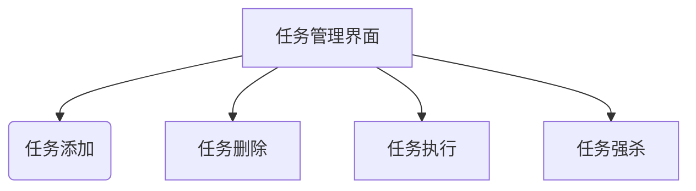

# go-crontab

go-crontab是使用Go语言基于etcd开发的一套分布式定时任务管理系统，该系统两大模块：master和work。master提供了web页面用于管理定时任务的增删改和任务的剔除操作，而work主要负责任务的监听，任务的调度，和任务的执行等操作;

### 一、master模块

```mermaid
graph TD
A[任务管理界面] --> B(任务添加)
A --> C[任务删除]
A --> D[任务执行]	
A --> E[任务强杀]
   
  
    
```

### 二、worker模块

